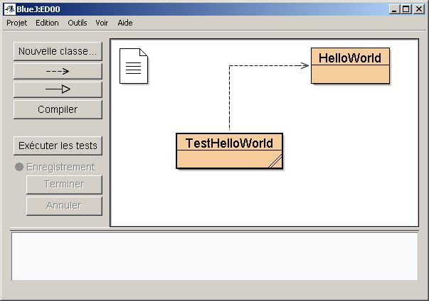
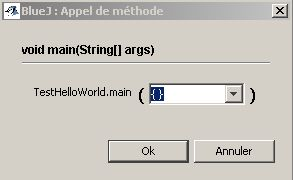
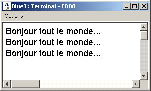
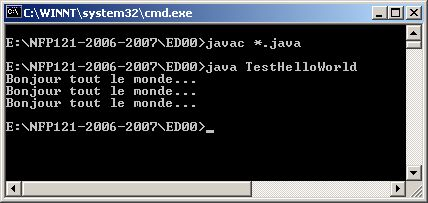

Lancer Bluej, dans le menu "Projet" choisir l'item "Nouveau projet...". Donner
un nom &agrave; ce projet et enregistrer &agrave; un endroit judicieux
(ATTENTION, Bluej cr&eacute;e un r&eacute;pertoire du nom choisi.

Dans l'interface Bluej clic sur le bouton "Nouvelle classe..." Cr&eacute;er
une "classe standard" de nom "HelloWorld" (Attention au respect des majuscules
et minuscule, Java est sensible &agrave; la casse des caract&egrave;res).

Éditer la classe "HelloWorld" par un double clic sur son diagramme et y
introduire le code donner dans la page pr&eacute;c&eacute;dente.

M&ecirc;me chose pour la classe "TestHelloWorld"...

Vous devez avoir obtenu le diagramme de classe suivant (sous Bluej!) :

Compilation :

<ul>
  <li>
    Bluej - clic sur le bouton compiler (ou fichier par fichier dans l'&eacute;diteur)
  <li>
    fen&ecirc;tre de commandes : dans le r&eacute;pertoire ed00 (si le projet
    Bluej se nomme ainsi) &gt;javac *.java
</ul>

Ex&eacute;cution :
<UL>
  <li>
    Bluej - clic -droit sur le diagramme de la classe TestHelloWorld (qui contient
    le "main") et choix de l'item &nbsp;"void main(String []args)" &nbsp;puis
    clic sur "ok" dans le fen&ecirc;tre suivante puisqu'il qu'on attend pas de
    param&egrave;tre sur la ligne de commande. 
    
  <li>
    fen&ecirc;tre de commandes : toujours dans le r&eacute;pertoire ed00 &gt;java
    TestHelloWorld. 
    
</UL>

