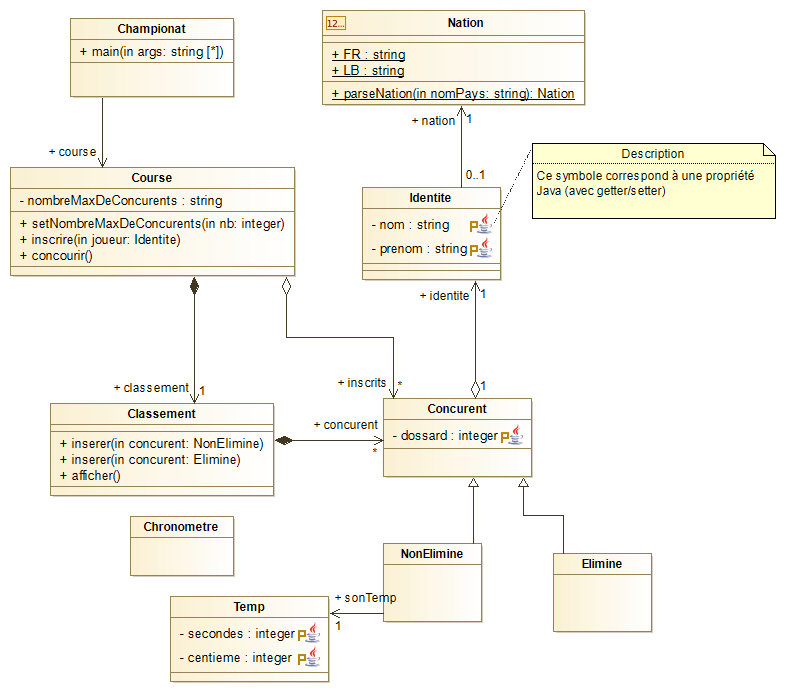

note : &nbsp;les Objets en <code class="red">ROUGE</code> et les actions
en <code class="green">VERT</code> et en italique 
  

Soit d&eacute;velopper une application pour le suivi d'une
<code class="red">course</code> de Ski. 

Il faut, pour cela, tout d'abord
<code class="green">inscrire</code> les
<code class="red">concurrents</code> en relevant
leur <code class="red">identit&eacute;</code> (nom, pr&eacute;noms,
nationalit&eacute;) et en leur attribuant un num&eacute;ro de dossard. 

Cette phase d'inscription termin&eacute;e, la course commence
Il faut alors <code class="green">lancer</code> les
d&eacute;parts dans l'ordre des dossards, relever les
<code class="red">temps</code> (secondes, centi&egrave;mes)
des concurrents <code class="red">NON-&eacute;limin&eacute;s
</code>(qui ont effectivement pass&eacute; la ligne d'arriv&eacute;e
...) et <code class="green">afficher</code> "en temps
r&eacute;el" le <code class="red">classement</code> de ces
concurrents avec leurs noms et leurs temps suivi dans le classement des
"<code class="red">Elimin&eacute;s"</code> la mention
"&eacute;limin&eacute;".

Remarques :
* nom , pr&eacute;noms , nationalit&eacute; , secondes , centi&egrave;mes ,
    num&eacute;ro de dossard correspondent plut&ocirc;t &agrave; des noms d'attributs
* ...

Diagrammes de classes : (construits &agrave; l'aide de l'outil Modelio UML et BMP:  [Modélio Open Source](https://www.modelio.org/) vous pouvez aussi ajouter le module génération de code Java [java-designer-open-source](https://store.modelio.org/resource/modules/java-designer-open-source.html)

[retour](ED00_CourseSki)

