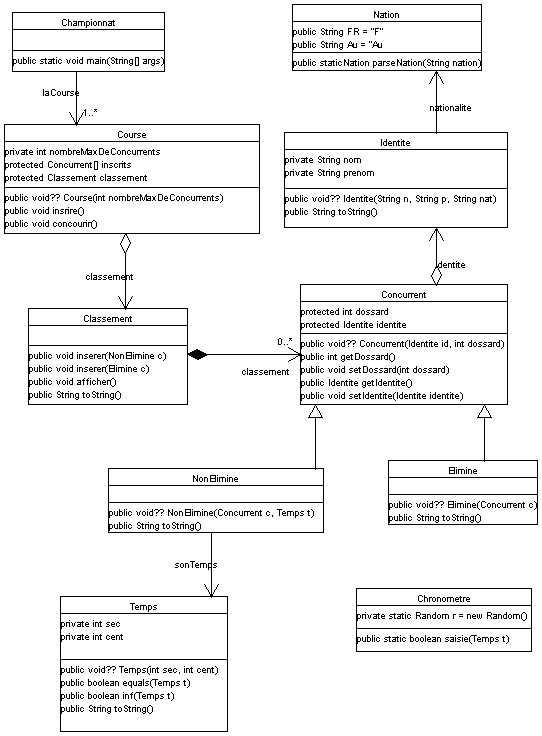

<SMALL>/* une id&eacute;e... &nbsp;</SMALL>

note : &nbsp;les Objets en ROUGE et les actions
en VERT et en italique 
  

<big>Soit d&eacute;velopper une application pour le suivi d'une
<big>course</big> de Ski. </big>

<big>Il faut, pour cela, tout d'abord
<big><i>inscrire</i></big> les
<big><big>concurrents</big></big> en relevant
leur <big>identit&eacute;</big> (nom, pr&eacute;noms,
nationalit&eacute;) et en leur attribuant un num&eacute;ro de dossard. </big>

<big>Cette phase d'inscription termin&eacute;e, la course commence
Il faut alors <big><I>lancer</I></big> les
d&eacute;parts dans l'ordre des dossards, relever les
<big>temps</big> (secondes, centi&egrave;mes)
des concurrents <big>NON-&eacute;limin&eacute;s
</big>(qui ont effectivement pass&eacute; la ligne d'arriv&eacute;e
...) et <big><I>afficher</I></big> "en temps
r&eacute;el" le <big>classement</big> de ces
concurrents avec leurs noms et leurs temps suivi dans le classement des
"<big>Elimin&eacute;s"</big> la mention
"&eacute;limin&eacute;".</big>

Remarques :
<ol>
  <li>
    nom , pr&eacute;noms , nationalit&eacute; , secondes , centi&egrave;mes ,
    num&eacute;ro de dossard correspondent plut&ocirc;t &agrave; des noms d'attributs
  <li>
    ...
</ol>

  

Diagrammes de classes : (construits &agrave; l'aide de l'outil Argo UML :
<a HREF="http://argouml.tigris.org">http://argouml.tigris.org</A>) :

[retour](.)

