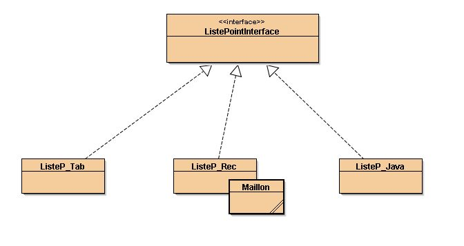
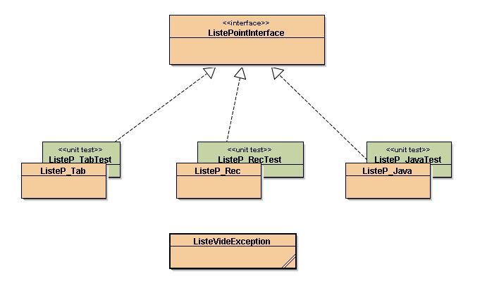
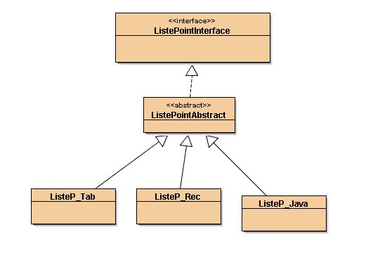

# Implémenter les listes pointées chères à LISP et à Prolog

Informellement : une liste pointée est représentée par

L = TETE.Reste_de_la_Liste 

ou

[TETE  Reste_de_la_Liste ]

en LISP traditionnellement TETE est obtenue traditionnellement par la fonction
car() et Reste_de_la_Liste par la fonction cdr(). Nous
reprendrons ces noms.

Les autres méthodes &#171;&nbsp;traditionnelles&nbsp;&#187; sur ces
listes sont :

* cons() : ajouter un élément en tête d'une
liste
* conc() : la concaténation de 2 listes.
* membre() : prédicat de l'appartenance d'un objet
à la liste.
* renverse() : procédure : retourne la liste sur elle même.
* listeVide() : prédicat qui répond &#145;true'
si la liste est vide.
* longueur() : nombre d'éléments de la liste

Les spécifications ci dessus nous ont permis de construire l'interface
suivante :


# Interface des listes pointées

  
```java
public interface ListePointInterface{
    /**
     * retourne la valeur du premier élément (la tête) de la liste sans destruction
     * simple lecture...
     * remarque :  on ne peut pas obtenir la tête d'une liste vide
     */ 
     Object car();
    /**
     * supprime la tete de la liste
     * remarque :  on ne peut pas supprimer la tête d'une liste vide
     */
     void cdr(); 
    /**
     * procédure : ajoute 'obj' au début de la liste;
     * la longueur de la liste est augmentée de 1
     */
    public void cons(Object objet);
    /**
     * procédure : concatène la liste 'lst' à 'this'
     */
    public void conc(ListePointInterface lst );
    /**
     * procédure : retourne la liste sur elle même
     */
    public void renverse();
    /**
     * prédicat : 'objet' appartient-il à la liste ?
     */ 
    public boolean membre(Object objet);
    /**
     * prédicat : 'this est-il une liste vide ?
     */
    public boolean listeVide();
    /**
     * retourne le nombre d'éléments dans la liste
     */
    public int longueur();  
}
```
  

*Remarques complémentaires :*

* Les listes sont de longueur quelconque, sont NON
bornées.
* L'affichage sera de la forme [objet1 , ... , objetn]


## A/ il est demandé d'implémenter l'interface ci dessus
de 3 manières différentes
* [implantation par un tableau](Exercices/LTAB-1)
* <a HREF="Exercices/LTAB-2.html">implantation par une structure de données récursive</a>
* <a HREF="Exercices/LTAB-3.html">implantation utilisant une api java : java.util.LinkedList</a>


nous obtenons ainsi le premier diagramme de classes :



## B/ vérifier par une classe de tests pertinents que les trois implantations ont le même comportement

on a maintenant le diagramme de classes suivant :




## C/ deux listes sont égales (par equals(...)) si
elles ont le même nombre d'éléments et que les
éléments au même rang sont égaux
(equals()). Donc on doit pouvoir comparer deux piles d'implantations
différentes. A vérifier !!!

remarque et rappel : 
* en fait nous comparons les "toString()" des listes donc le point
    C semble assez simple à condition que les 3 "toString()"
    génèrent la même chose.
* construire de "vraies" méthodes equals(...)


## D/classe abstraite : on veut maintenant le diagramme
de classes suivant :



que peut-on transferer "au maximum" dans cette classe abstraite ?

## E/clone : rendre les listes (toutes) clonable et
développer la méthode clone dans chacune des classes. d'abord
une copie superficielle puis une copie profonde.

## F/des idées à perfectionner... Ouvrir dans blueJ le répertoire <RACINEDESGIT>\NFP121\ED\ed2\Exercices\ListesIdees 

_ne faite ceci qu'après avoir essayer de résoudre les questions seul..._ 

<hr COLOR="#00ff00" />

# Expressions Arithmétiques entières 

<hr COLOR="#00ff00" />

Construire une application Java pour l'évaluation et l'affichage
  d'expressions arithmétiques entières "classiques".
  
On part de la syntaxe abstraite :
  
    
1. catégories syntaxiques :

>    e,e1,e2 &isin; Exp<br/>
    o &isin; {+ | - | * | /}<br/>
    n &isin; Entier
	
2. définitions :
	
>	  e ::= n | e1 o e2
	
      
    
  
  
=> <a HREF="Exercices/exo.J03.1.html">(1)</a> : Version impérative
  : Construire/spécifier une classe pour l'évaluation&nbsp;et
  l'affichage des expressions arithmétiques numériques .
  
=> <a HREF="Exercices/exo.J03.2.html">(2)</a> : Première Vision
  objet : pattern COMPOSITE.
  
=> <a HREF="Exercices/exo.J03.3.html">
  (3)</a> : Vision OO : granularité plus fine , ajout de nouvelles méthodes...

=> <a HREF="Exercices/exo.J03.4.html">(4)</a> : pattern VISITEUR.

