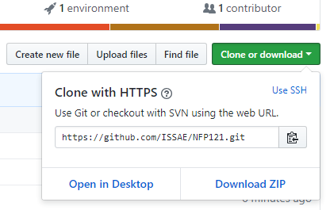
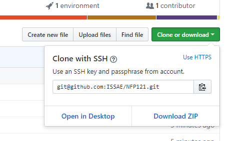

# Bluej

Télécharger et installer la dernière version de [BlueJ](https://www.bluej.org/)

Si vous souhaitez utiliser la même jdk que BlueJ en ligne de commande : définir la variable d'environnement JDK_HOME et modifier le PATH (voir cette vidéo)


# git

Récupérer git for windows [ici](https://git-scm.com/download/win)

Après installation vous aurez un gitbash (qui donne un environnement de commande unix) ainsi les commandes éventuelles que nous décrirons dans les sujet de TP seront les mêmes que vous utiliser Windows, Mac ou Linux

Voici une petite présentation en image:

<iframe src="https://docs.google.com/presentation/d/e/2PACX-1vR4hsKqnQNMa382iRIQf3OMeB8UlcpIPEDWckhoYNScudIC-wEwpDKZ_ldkXxh8m8rULWklnkEzkE_s/embed?start=false&loop=false&delayms=3000" frameborder="0" width="918" height="549" allowfullscreen="true" mozallowfullscreen="true" webkitallowfullscreen="true"></iframe>


# compte github

Voici une petite présentation en image:

<iframe width="560" height="315" src="https://www.youtube.com/embed/NHA9jiZ2fHE" frameborder="0" allow="accelerometer; autoplay; encrypted-media; gyroscope; picture-in-picture" allowfullscreen></iframe>

## faire le fork des sujets de TP


## configurer votre projet "forké"

## récupérer le code sur votre pc

La première fois
```bash
git clone <référenced de votre projet github>
```
 ou 

De temps en temps récupérer les dernières modification du projet d'origine  ``` git pull https://github.com/ISSAE/NFP121.git```


```bash
pascalfares@DomicileTerra:~$ git clone git@github.com:nfp121/NFP121.git
Cloning into 'NFP121'...
remote: Enumerating objects: 272, done.
remote: Counting objects: 100% (272/272), done.
remote: Compressing objects: 100% (193/193), done.
remote: Total 272 (delta 77), reused 250 (delta 59), pack-reused 0
Receiving objects: 100% (272/272), 46.12 MiB | 674.00 KiB/s, done.
Resolving deltas: 100% (77/77), done.
Checking out files: 100% (190/190), done.
pascalfares@DomicileTerra:~$ cd NFP121/
pascalfares@DomicileTerra:~/NFP121$ # Je suis dans le répértoire git de travail
pascalfares@DomicileTerra:~/NFP121$ # faire de temps en temps
pascalfares@DomicileTerra:~/NFP121$ git pull https://github.com/ISSAE/NFP121.git
remote: Enumerating objects: 94, done.
remote: Counting objects: 100% (94/94), done.
remote: Compressing objects: 100% (44/44), done.
remote: Total 84 (delta 34), reused 77 (delta 27), pack-reused 0
Unpacking objects: 100% (84/84), done.
From https://github.com/ISSAE/NFP121
 * branch            HEAD       -> FETCH_HEAD
Updating 346a04a..d86ac3d
Checking out files: 100% (383/383), done.
Fast-forward
 Complements/README.md                                              |   0
 Complements/exemples/Premiers_Exemples/Carre.ctxt                  |   9 +
 Complements/exemples/Premiers_Exemples/Carre.java                  |  22 ++
etc....
```

## configurer votre projet "forké"

## Un peu de markdown (pour publier vos documentations)

#### Exemple d'inclusion de code Java

```java
/**
     * Create a Canvas.
     * 
     * @param title
     *            title to appear in Canvas Frame
     * @param width
     *            the desired width for the canvas
     * @param height
     *            the desired height for the canvas
     * @param bgClour
     *            the desired background colour of the canvas
     */
    private Canvas(String title, int width, int height, Color bgColour) {
        frame = new JFrame();
        canvas = new CanvasPane();
        frame.setContentPane(canvas);
        frame.setTitle(title);
        canvas.setPreferredSize(new Dimension(width, height));
        backgroundColour = bgColour;
        frame.pack();
        objects = new ArrayList<Object>();
        shapes = new HashMap<Object, ShapeDescription>();
    }
```

# [Option] créer une branche pour chaque TP

# JDK 8

# Netbeans

# maven
