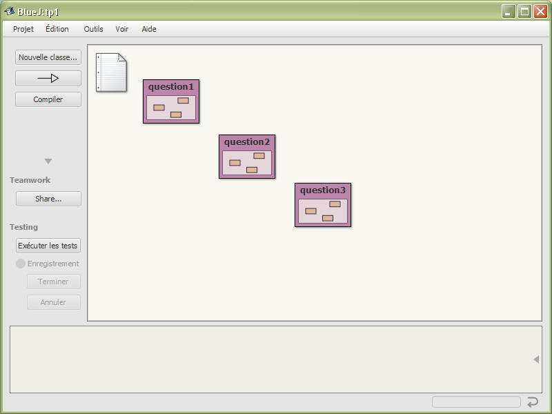

Avoir installer la dernière version de BlueJ

Avoir installer la dernière de git pour windows (ou git pour linux)

Utilisation de BlueJ et récupération/soumission de vos travaux dans votre projet github dédié à
ce cours

<ol>
<li>Créer votre compte github avec vos adresse email de l'@isae.edu.lb et le nom d'utilisateur
identifiant Cnam Liban [Voir la vidéo](https://youtu.be/UShoAaZihRU)</li>
<li>Créer un fork du projet github https://github.com/ISSAE/NFP121</li>
<li>cloner en local votre projet issue du fork par exemple dans c:\sharing\mesgit\</li>
<li>Lancer Bluej, puis ouvrir le projet qui se trouve c:\sharing\mesgit\NFP121\tp1</li>
</ol>
 
Vous obtenez :

Les 3 questions correspondent aux 3 paquetages
<ul>
<li>si vous avez cloner dans c:\sharing\mesgit\ Votre projet tp1 se trouve maintenant dans le
répertoire : 'c:\sharing\mesgit\NFP121\tp1'</li>
<li>L'énoncé du TP/TD ('tp1') est dans ce répertoire en 'c:\sharing\mesgit\NFP121\tp1\tp1.html'. ou
encore https://issae.github.io/NFP121/tp1/tp1.html</li>
</ul>

Introduction

Champs, constructeurs, méthodes et instances d'une classe (introduction extraite du livre Objects First
de M .Kölling,
<a target="_blank" href="http://jfod.cnam.fr/progAvancee/objects-first-ch1.pdf">chapitre 1 de
Objects-First</a>).
<ol>
<li>Allez dans le paquetage question1</li>
<li>Puis créer plusieurs instances,</li>
<li>Déclenchez les méthodes d'instance,</li>
<li>Vérifier les champs d'instance des classes "Circle, Square et Triangle"</li>
<li>Une première <a href="./doc/index.html" target="_blank">documentation</a> , ( générée par Bluej
Menu Outils en fait javadoc)</li>
</ol>

 

Introduction suite

<ol>
<li>Créer une instance de la classe Picture, Modifier le source "Picture.java" afin que le soleil
soit bleu,</li>
<li>Ajouter une nouvelle donnée d'instance : un nouveau soleil (jaune...),</li>
<li>Ajouter une nouvelle méthode à la classe Picture permettant au soleil ( bleu) de se coucher (si
la terre est fixe...), voir la méthode slowMoveVertical de la classe "Circle"</li>
</ol>
 
Répondre aux autres exercices du
<a target="_blank" href="http://jfod.cnam.fr/progAvancee/objects-first-ch1.pdf">chapitre 1 de
Objects-First</a>

 

Introduction, tests, mise en oeuvre

<ol>
<li>Le paquetage question3 contient la classe AuditeurCnam fondée sur le squelette de programme
suivant :</li>
<li>

<code>
<b>public&nbsp;class&nbsp;</b>AuditeurCNAM&nbsp;{
 
&nbsp;&nbsp;&nbsp;&nbsp;/**&nbsp;l'attribut&nbsp;nom&nbsp;de&nbsp;chaque&nbsp;auditeur.&nbsp;*/
 
&nbsp;&nbsp;&nbsp;&nbsp;<b>private&nbsp;</b>String&nbsp;nom;
 
&nbsp;&nbsp;&nbsp;&nbsp;/**&nbsp;l'attribut&nbsp;prenom&nbsp;de&nbsp;chaque&nbsp;auditeur.&nbsp;*/
 
&nbsp;&nbsp;&nbsp;&nbsp;<b>private&nbsp;</b>String&nbsp;prenom;
 
&nbsp;&nbsp;&nbsp;&nbsp;/**&nbsp;l'attribut&nbsp;matricule&nbsp;de&nbsp;chaque&nbsp;auditeur.&nbsp;*/
 
&nbsp;&nbsp;&nbsp;&nbsp;<b>private&nbsp;</b>String&nbsp;matricule;
 

 
&nbsp;&nbsp;&nbsp;&nbsp;/**
 
&nbsp;&nbsp;&nbsp;&nbsp;&nbsp;*&nbsp;&#34;Cr&eacute;ation&#34;,&nbsp;le&nbsp;constructeur&nbsp;d'un&nbsp;auditeur&nbsp;avec&nbsp;son&nbsp;nom,&nbsp;son&nbsp;pr&eacute;nom&nbsp;et&nbsp;son
 
&nbsp;&nbsp;&nbsp;&nbsp;&nbsp;*&nbsp;matricule.
 
&nbsp;&nbsp;&nbsp;&nbsp;&nbsp;*&nbsp;
 
&nbsp;&nbsp;&nbsp;&nbsp;&nbsp;*&nbsp;@param&nbsp;nom
 
&nbsp;&nbsp;&nbsp;&nbsp;&nbsp;*&nbsp;&nbsp;&nbsp;&nbsp;&nbsp;&nbsp;&nbsp;&nbsp;&nbsp;&nbsp;&nbsp;&nbsp;le&nbsp;nom&nbsp;de&nbsp;l'auditeur
 
&nbsp;&nbsp;&nbsp;&nbsp;&nbsp;*&nbsp;@param&nbsp;prenom
 
&nbsp;&nbsp;&nbsp;&nbsp;&nbsp;*&nbsp;&nbsp;&nbsp;&nbsp;&nbsp;&nbsp;&nbsp;&nbsp;&nbsp;&nbsp;&nbsp;&nbsp;son&nbsp;pr&eacute;nom
 
&nbsp;&nbsp;&nbsp;&nbsp;&nbsp;*&nbsp;@param&nbsp;matricule
 
&nbsp;&nbsp;&nbsp;&nbsp;&nbsp;*&nbsp;&nbsp;&nbsp;&nbsp;&nbsp;&nbsp;&nbsp;&nbsp;&nbsp;&nbsp;&nbsp;&nbsp;sur&nbsp;la&nbsp;carte&nbsp;d'inscription,&nbsp;pr&egrave;s&nbsp;de&nbsp;la&nbsp;photo
 
&nbsp;&nbsp;&nbsp;&nbsp;&nbsp;*/
 
&nbsp;&nbsp;&nbsp;&nbsp;<b>public&nbsp;</b>AuditeurCNAM(String&nbsp;nom,&nbsp;String&nbsp;prenom,&nbsp;String&nbsp;matricule)&nbsp;{
 
&nbsp;&nbsp;&nbsp;&nbsp;&nbsp;&nbsp;&nbsp;&nbsp;<b>this</b>.nom&nbsp;=&nbsp;nom;
 
&nbsp;&nbsp;&nbsp;&nbsp;&nbsp;&nbsp;&nbsp;&nbsp;<b>this</b>.prenom&nbsp;=&nbsp;prenom;
 
&nbsp;&nbsp;&nbsp;&nbsp;&nbsp;&nbsp;&nbsp;&nbsp;<b>this</b>.matricule&nbsp;=&nbsp;matricule;
 
&nbsp;&nbsp;&nbsp;&nbsp;}
 

 
&nbsp;&nbsp;&nbsp;&nbsp;/**
 
&nbsp;&nbsp;&nbsp;&nbsp;&nbsp;*&nbsp;le&nbsp;login&nbsp;au&nbsp;Cnam&nbsp;:&nbsp;6&nbsp;premi&egrave;res&nbsp;lettres&nbsp;du&nbsp;nom&nbsp;suivies&nbsp;de&nbsp;la&nbsp;premi&egrave;re
 
&nbsp;&nbsp;&nbsp;&nbsp;&nbsp;*&nbsp;lettre&nbsp;du&nbsp;pr&eacute;nom&nbsp;s&eacute;par&eacute;es&nbsp;de&nbsp;'_'&nbsp;.&nbsp;le&nbsp;login&nbsp;retourn&eacute;&nbsp;est&nbsp;en&nbsp;minuscules,
 
&nbsp;&nbsp;&nbsp;&nbsp;&nbsp;*&nbsp;le&nbsp;trait&nbsp;d'union,&nbsp;ou&nbsp;sp&eacute;ciaux&nbsp;&lt;i&gt;(pour&nbsp;unix)&lt;/i&gt;&nbsp;sont&nbsp;remplac&eacute;s&nbsp;par&nbsp;des
 
&nbsp;&nbsp;&nbsp;&nbsp;&nbsp;*&nbsp;'_'&nbsp;pas&nbsp;de&nbsp;caract&egrave;res&nbsp;accentu&eacute;s&nbsp;pour&nbsp;le&nbsp;login&nbsp;voir&nbsp;les&nbsp;classes
 
&nbsp;&nbsp;&nbsp;&nbsp;&nbsp;*&nbsp;pr&eacute;d&eacute;fines,&nbsp;java.lang.String&nbsp;:&nbsp;les&nbsp;m&eacute;thodes&nbsp;replaceAll,&nbsp;toLowerCase&nbsp;et
 
&nbsp;&nbsp;&nbsp;&nbsp;&nbsp;*&nbsp;substring&nbsp;java.lang.Math&nbsp;:&nbsp;la&nbsp;m&eacute;thode&nbsp;min&lt;br&gt;
 
&nbsp;&nbsp;&nbsp;&nbsp;&nbsp;*&nbsp;&lt;b&gt;BlueJ&nbsp;:&nbsp;Menu&nbsp;Aide&lt;/b&gt;
 
&nbsp;&nbsp;&nbsp;&nbsp;&nbsp;*&nbsp;
 
&nbsp;&nbsp;&nbsp;&nbsp;&nbsp;*&nbsp;@return&nbsp;le&nbsp;login&nbsp;du&nbsp;Cnam&nbsp;simplifi&eacute;,&nbsp;sans&nbsp;les&nbsp;adaptations&nbsp;dues&nbsp;aux
 
&nbsp;&nbsp;&nbsp;&nbsp;&nbsp;*&nbsp;&nbsp;&nbsp;&nbsp;&nbsp;&nbsp;&nbsp;&nbsp;&nbsp;homonymes...
 
&nbsp;&nbsp;&nbsp;&nbsp;&nbsp;*/
 
&nbsp;&nbsp;&nbsp;&nbsp;<b>public&nbsp;</b>String&nbsp;login()&nbsp;{
 
&nbsp;&nbsp;&nbsp;&nbsp;&nbsp;&nbsp;&nbsp;&nbsp;<b>return&nbsp;</b>&#34;&#34;;//&nbsp;&agrave;&nbsp;compl&eacute;ter
 
&nbsp;&nbsp;&nbsp;&nbsp;}
 

 
&nbsp;&nbsp;&nbsp;&nbsp;/**
 
&nbsp;&nbsp;&nbsp;&nbsp;&nbsp;*&nbsp;Lecture&nbsp;du&nbsp;nom&nbsp;de&nbsp;l'auditeur.
 
&nbsp;&nbsp;&nbsp;&nbsp;&nbsp;*&nbsp;
 
&nbsp;&nbsp;&nbsp;&nbsp;&nbsp;*&nbsp;@return&nbsp;son&nbsp;nom
 
&nbsp;&nbsp;&nbsp;&nbsp;&nbsp;*/
 
&nbsp;&nbsp;&nbsp;&nbsp;<b>public&nbsp;</b>String&nbsp;nom()&nbsp;{
 
&nbsp;&nbsp;&nbsp;&nbsp;&nbsp;&nbsp;&nbsp;&nbsp;<b>return&nbsp;null</b>;//&nbsp;&agrave;&nbsp;compl&eacute;ter
 
&nbsp;&nbsp;&nbsp;&nbsp;}
 

 
&nbsp;&nbsp;&nbsp;&nbsp;/**
 
&nbsp;&nbsp;&nbsp;&nbsp;&nbsp;*&nbsp;Lecture&nbsp;du&nbsp;pr&eacute;nom&nbsp;de&nbsp;l'auditeur.
 
&nbsp;&nbsp;&nbsp;&nbsp;&nbsp;*&nbsp;
 
&nbsp;&nbsp;&nbsp;&nbsp;&nbsp;*&nbsp;@return&nbsp;son&nbsp;pr&eacute;nom
 
&nbsp;&nbsp;&nbsp;&nbsp;&nbsp;*/
 
&nbsp;&nbsp;&nbsp;&nbsp;<b>public&nbsp;</b>String&nbsp;prenom()&nbsp;{
 
&nbsp;&nbsp;&nbsp;&nbsp;&nbsp;&nbsp;&nbsp;&nbsp;<b>return&nbsp;null</b>;//&nbsp;&agrave;&nbsp;compl&eacute;ter
 
&nbsp;&nbsp;&nbsp;&nbsp;}
 

 
&nbsp;&nbsp;&nbsp;&nbsp;/**
 
&nbsp;&nbsp;&nbsp;&nbsp;&nbsp;*&nbsp;Lecture&nbsp;du&nbsp;matricule&nbsp;de&nbsp;l'auditeur.
 
&nbsp;&nbsp;&nbsp;&nbsp;&nbsp;*&nbsp;
 
&nbsp;&nbsp;&nbsp;&nbsp;&nbsp;*&nbsp;@return&nbsp;son&nbsp;matricule
 
&nbsp;&nbsp;&nbsp;&nbsp;&nbsp;*/
 
&nbsp;&nbsp;&nbsp;&nbsp;<b>public&nbsp;</b>String&nbsp;matricule()&nbsp;{
 
&nbsp;&nbsp;&nbsp;&nbsp;&nbsp;&nbsp;&nbsp;&nbsp;<b>return&nbsp;null</b>;//&nbsp;&agrave;&nbsp;compl&eacute;ter
 
&nbsp;&nbsp;&nbsp;&nbsp;}
 

 
&nbsp;&nbsp;&nbsp;&nbsp;/**
 
&nbsp;&nbsp;&nbsp;&nbsp;&nbsp;*&nbsp;m&eacute;thode&nbsp;toString&nbsp;(&nbsp;m&eacute;thode&nbsp;red&eacute;finie&nbsp;de&nbsp;la&nbsp;classe&nbsp;Object).
 
&nbsp;&nbsp;&nbsp;&nbsp;&nbsp;*&nbsp;
 
&nbsp;&nbsp;&nbsp;&nbsp;&nbsp;*&nbsp;@return&nbsp;la&nbsp;concat&eacute;nation&nbsp;du&nbsp;nom,&nbsp;du&nbsp;pr&eacute;nom&nbsp;et&nbsp;du&nbsp;login,&nbsp;selon&nbsp;cette
 
&nbsp;&nbsp;&nbsp;&nbsp;&nbsp;*&nbsp;&nbsp;&nbsp;&nbsp;&nbsp;&nbsp;&nbsp;&nbsp;&nbsp;syntaxe
 
&nbsp;&nbsp;&nbsp;&nbsp;&nbsp;*&nbsp;&nbsp;&nbsp;&nbsp;&nbsp;&nbsp;&nbsp;&nbsp;&nbsp;&lt;code&gt;nom()&nbsp;+&nbsp;&#34;&nbsp;&#34;&nbsp;+&nbsp;prenom()&nbsp;+&nbsp;&nbsp;&#34;&nbsp;login&nbsp;:&nbsp;&#34;&nbsp;+&nbsp;login()&lt;/code&gt;
 
&nbsp;&nbsp;&nbsp;&nbsp;&nbsp;*/
 
&nbsp;&nbsp;&nbsp;&nbsp;@Override
 
&nbsp;&nbsp;&nbsp;&nbsp;<b>public&nbsp;</b>String&nbsp;toString()&nbsp;{
 
&nbsp;&nbsp;&nbsp;&nbsp;&nbsp;&nbsp;&nbsp;&nbsp;<b>return&nbsp;</b>nom()&nbsp;+&nbsp;&#34;&nbsp;&#34;&nbsp;+&nbsp;prenom()&nbsp;+&nbsp;&#34;&nbsp;login&nbsp;:&nbsp;&#34;&nbsp;+&nbsp;login();
 
&nbsp;&nbsp;&nbsp;&nbsp;}
 
}
</code>

</li>
<li>Lire la <a href="./doc/index.html" target="_blank">documentation</a> de cette classe</li>
<li>Complétez cette classe</li>
<li>Créer plusieurs instances (clic droit sur la classe), vérifiez la valeur des données
d'instances avec l'inspecteur d'objets </li>
<li>Exécutez les tests unitaires proposés, ceux-ci sont minimaux</li>
<li>Ajoutez vos propres tests, voir le tutoriel "<a href="http://www.bluej.org/doc/documentation.html" target="_blank">Unit Testing in BlueJ</a>"</li>
</ol>
Envoyer votre projet sur le github

