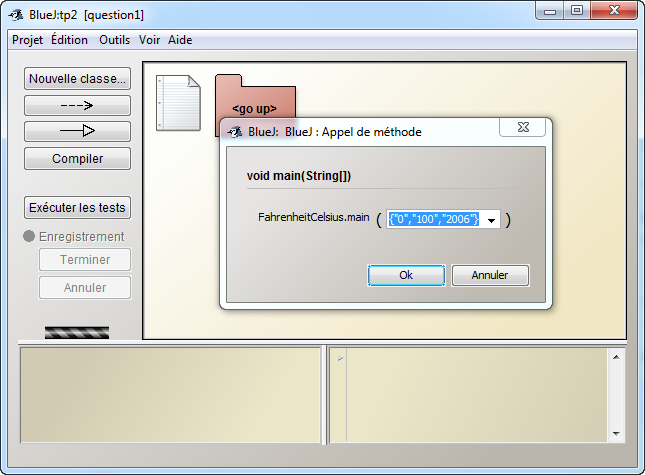
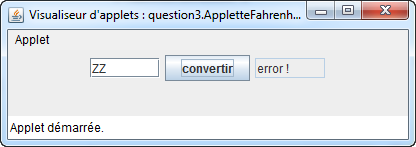

Lectures préalables :  
<ul>
<li>Java_I</li>
<li><a href="http://docs.oracle.com/javase/tutorial/index.html" target="_blank">The Java&trade; Tutorials</a> <i>(Getting Started et Learning the Java Language)</i></li>
</ul>
 
Thèmes du TP :
<ul>
<li>Utilisation de <a href="http://www.bluej.org/" target="_blank">BlueJ</a></li>
<li>Java impératif</li>
<li>Exceptions</li>
</ul>
 
Ce TP est consacré à une application Java de conversion des degrés Fahrenheit (Angleterre) en degrés Celsius (reste de l'Europe!). 
 
 
 

La classe "FahrenheitCelsius"

Ouvrir avec Bluej le projet "tp2", descendre dans le paquetage "question1" où l'on découvre la classe "FahrenheitCelsius".
 
 
C'est dans cette classe qu'est effectuée la conversion. Cette classe est une application car elle contient la méthode : 
 
 
<code>
&nbsp;&nbsp;<b>public&nbsp;static&nbsp;</b><b>float&nbsp;</b>fahrenheitEnCelsius(<b>int&nbsp;</b>f)&nbsp;{&nbsp;//..
 
</code>
 
<b>Compléter les 2 méthodes de cette classe</b>
 
 
<b>Contraintes :</b> 
<ul>
<li>La formule de conversion : °C = 5/9 * (°F -32) 
</li>
<li><i>Les valeurs en degrés Fahrenheit à convertir sont données sur la ligne de commande.</i> 
</li>
<li><i>Ce sont des valeurs entières.</i> 
</li>
<li><i>Le résultat est attendu avec un seul chiffre derrière la virgule, obtenu uniquement par le calcul.</i> ( par exemple r = ((int)resultat*10)/10.0 )</li>
</ul>
 
<b>Exécution sous Bluej : </b>
 
 
"clic droit" sur le diagramme de la classe "FahrenheitCelsius" , choisir l'item "void main(String[] args)", introduire des données comme ci dessous par exemple ...

Le résultat dans la fenêtre Terminal

<b>Technique Java :</b>
<ul>
<li>Les arguments de la ligne de commande sont des chaînes (String), donc pour effectuer la conversion il faut les convertir en entiers  (cf. static int parseInt(String s) de la classe <a href="http://docs.oracle.com/javase/7/docs/api/index.html?java/lang/Integer.html" target="_blank">Integer</a> du paquetage java.lang)</li>
<li>Pour les tableaux, le champ length contient le nombre d'éléments du tableau (ATTENTION le premier indice d'un tableau est 0).</li>
<li>Attention : la division entre 2 entiers est une division entière . Exemple 5/9 = 0  et 9/5 = 1</li>
</ul>

 

La classe de tests unitaires "FahrenheitCelsiusTest"

Enrichissez la classe de tests unitaires comparant des résultats calculés à des résultats attendus. 
 
Lire le tutoriel "<a href="http://www.bluej.org/doc/documentation.html" target="_blank">Unit Testing in BlueJ</a>" sur les classes de tests sous Bluej et un exemple est donné dans le projet... 

 

La gestion de l'exception "NumberFormatException"

"runtime" Exceptions : 
 
Descendre maintenant dans le paquetage "question2" où l'on découvre une autre version de la classe "FahrenheitClesius". 
 
Développez une nouvelle version de cette classe en reprenant la conversion de la question 1 et en ajoutant la gestion de l'exception <b>"<a href="http://docs.oracle.com/javase/7/docs/api/index.html?java/lang/NumberFormatException.html" target="_blank">NumberFormatException</a>"</b>. 
 

L'exception <b>"NumberFormatException"</b> est levée lors d'une mauvaise entrée  sur la ligne de commande i.e. d'une entrée autre qu'une chaîne convertible en "int"

Exemple : {"10","ZZ","100"} engendre : 
 
<b>For input string: "ZZ"</b> est généré par l'appel de e.getMessage() .   e étant le nom de l'Exception soit <b><i>System.out.println("error : " + e.getMessage());</i></b>

 

La classe de tests unitaires

Développez une classe de tests unitaires (cf. question1)

 

 IHM

Descendre maintenant dans le paquetage "question2" et compléter l'"IHM 
Fahrenheit" fournie en utilisant la fonction de conversion de la question, 
cette IHM doit avoir un comportement analogue à cette interface. 
Celle-ci s'exécutera facilement dans votre environnement en 
déclenchant la méthode de classe main (clic droit, classe 
IHMFahrenheit)

Aide au comportement attendu :

 
<applet code="question3.AppletteFahrenheit.class" align="baseline" width="400" height="66" archive="applettes.jar"><paramname="backgroundColor" value="0xc0c0c0"></applet>

&nbsp;

L'applette de l'énoncé devrait s'exécuter, au 
dessus de cette ligne et présenter une interface,  
<b>attention certains navigateurs pour des raisons de 
sécurité ne le permettent plus.</b>

Il vous faut utiliser un outil du JDK, depuis le répertoire de ce tp dans 
une console, exécuter cette commande:

<b>&gt;appletviewer tp2.html&nbsp;&nbsp;&nbsp;&nbsp;&nbsp; 
ou bien appletviewer http://jfod.cnam.fr/progAvancee/tp2/tp2.html</b>

&nbsp;&nbsp;&nbsp; sous windows&nbsp; &gt; set 
PATH=&quot;c:/ installation de bluej /jdk/bin&quot;;%PATH%

<blockquote>

ou bien modifier la variable d'environnement

</blockquote>

 

Prise en compte de l'exception "NumberFormatException"

Ajoutez à l'IHM la prise en compte de l'exception "NumberFormatException" : si cette exception est levée la sortie mentionnera le libellé "error !", comme le montre cette copie d'écran 

<blockquote>
  <blockquote>

<b>&gt;appletviewer http://jfod.cnam.fr/progAvancee/tp2/tp2.html</b>

  </blockquote>
</blockquote>

Prise en compte du zéro absolu

Complétez L'IHM par la prise en compte du zéro absolu : la valeur minimale ne peut être inférieure en à -273.1°C, un fonctionnement analogue à l'applette de 
l'énoncé ( if(celsius < -273.1F) celsius = -273.1F)
<blockquote>
  

<b>&gt;appletviewer http://jfod.cnam.fr/progAvancee/tp2/tp2.html</b>
  

</blockquote>

 

