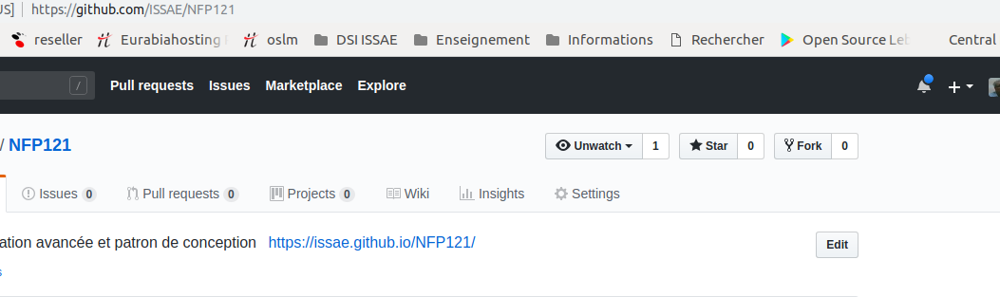

# Bluej

Télécharger et installer la dernière version de [BlueJ](https://www.bluej.org/)

# git

Récupérer git for windows ici https://git-scm.com/download/win 

Après installation vous aurez un gitbash (qui donne un environnement de commande unix) ainsi les commandes éventuelles que nous décrirons dans les sujet de TP seront les mêmes que vous utiliser Windows, Mac ou Linux

Voici une petite présentation en image:


# compte github

Voici une petite présentation en image:

<iframe width="560" height="315" src="https://www.youtube.com/embed/NHA9jiZ2fHE" frameborder="0" allow="accelerometer; autoplay; encrypted-media; gyroscope; picture-in-picture" allowfullscreen></iframe>

# faire le fork des sujets de TP



# configurer votre projet "forké"

# Un peu de markdown (pour publier vos documentations)

## Exemple d'inclusion de code Java

```java
/**
     * Create a Canvas.
     * 
     * @param title
     *            title to appear in Canvas Frame
     * @param width
     *            the desired width for the canvas
     * @param height
     *            the desired height for the canvas
     * @param bgClour
     *            the desired background colour of the canvas
     */
    private Canvas(String title, int width, int height, Color bgColour) {
        frame = new JFrame();
        canvas = new CanvasPane();
        frame.setContentPane(canvas);
        frame.setTitle(title);
        canvas.setPreferredSize(new Dimension(width, height));
        backgroundColour = bgColour;
        frame.pack();
        objects = new ArrayList<Object>();
        shapes = new HashMap<Object, ShapeDescription>();
    }
```

# [Option] créer une branche pour chaque TP

# JDK 8

# Netbeans

# maven
